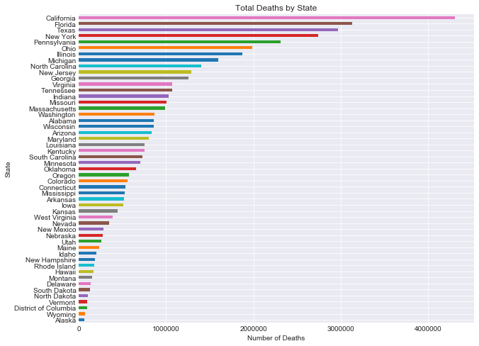
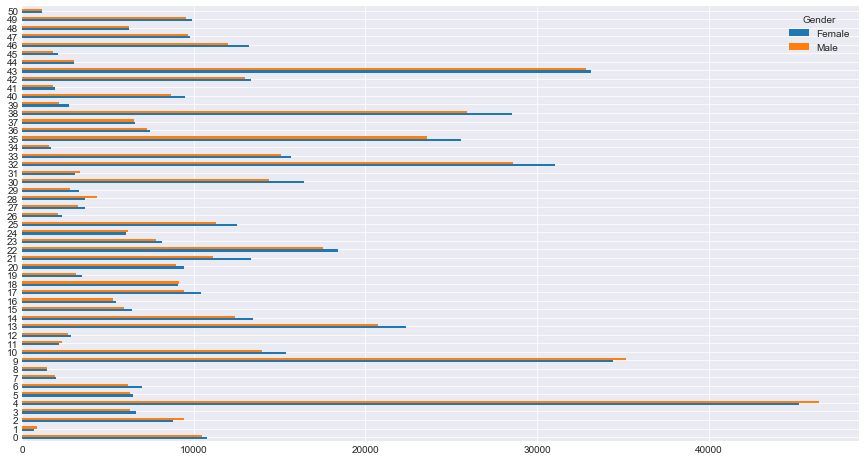
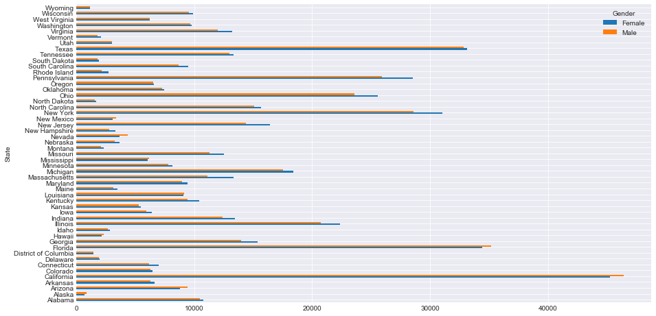
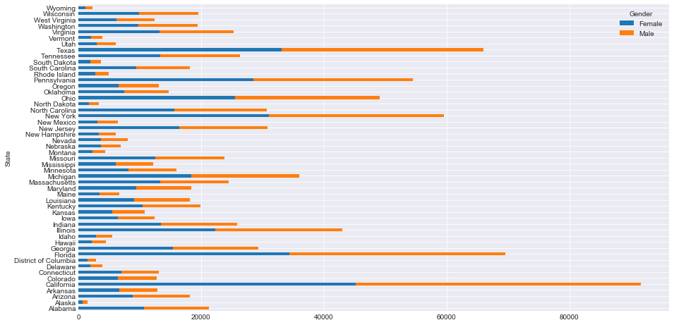
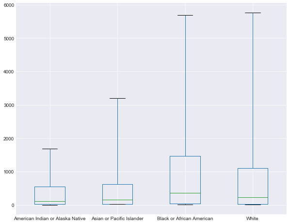
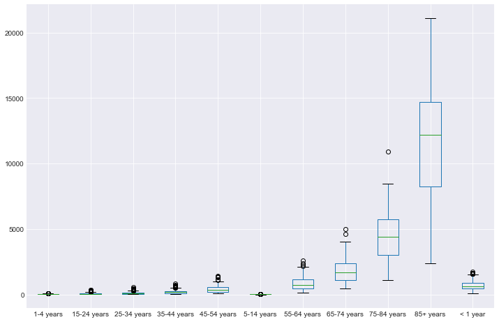

## Import Pandas and Matplotlib.pyplot using standard aliases
Also run the ipython magic command to display matplotlib graphs within the notebook.


```python
import pandas as pd
import matplotlib.pyplot as plt
%matplotlib inline
```

## Load the Data
The data for this activity is stored in a file called 'causes_of_death.tsv' which is a somewhat morbid dataset from the center for disease control. Note that the file extension .tsv indicates that this data is formatted slightly differently then the standard .csv, the difference being that it has 'tab seperated values' instead of 'comma seperated values'. As such, pass in the optional parameter `delimiter='\t'` into the pd.read_csv() method.


```python
df = pd.read_csv('causes_of_death.tsv', delimiter='\t')
df.head()
```


<div>
<style scoped>
    .dataframe tbody tr th:only-of-type {
        vertical-align: middle;
    }

    .dataframe tbody tr th {
        vertical-align: top;
    }

    .dataframe thead th {
        text-align: right;
    }
</style>
<table border="1" class="dataframe">
  <thead>
    <tr style="text-align: right;">
      <th></th>
      <th>Notes</th>
      <th>State</th>
      <th>State Code</th>
      <th>Ten-Year Age Groups</th>
      <th>Ten-Year Age Groups Code</th>
      <th>Gender</th>
      <th>Gender Code</th>
      <th>Race</th>
      <th>Race Code</th>
      <th>Deaths</th>
      <th>Population</th>
      <th>Crude Rate</th>
    </tr>
  </thead>
  <tbody>
    <tr>
      <th>0</th>
      <td>NaN</td>
      <td>Alabama</td>
      <td>1</td>
      <td>&lt; 1 year</td>
      <td>1</td>
      <td>Female</td>
      <td>F</td>
      <td>American Indian or Alaska Native</td>
      <td>1002-5</td>
      <td>14</td>
      <td>3579</td>
      <td>Unreliable</td>
    </tr>
    <tr>
      <th>1</th>
      <td>NaN</td>
      <td>Alabama</td>
      <td>1</td>
      <td>&lt; 1 year</td>
      <td>1</td>
      <td>Female</td>
      <td>F</td>
      <td>Asian or Pacific Islander</td>
      <td>A-PI</td>
      <td>24</td>
      <td>7443</td>
      <td>322.5</td>
    </tr>
    <tr>
      <th>2</th>
      <td>NaN</td>
      <td>Alabama</td>
      <td>1</td>
      <td>&lt; 1 year</td>
      <td>1</td>
      <td>Female</td>
      <td>F</td>
      <td>Black or African American</td>
      <td>2054-5</td>
      <td>2093</td>
      <td>169339</td>
      <td>1236.0</td>
    </tr>
    <tr>
      <th>3</th>
      <td>NaN</td>
      <td>Alabama</td>
      <td>1</td>
      <td>&lt; 1 year</td>
      <td>1</td>
      <td>Female</td>
      <td>F</td>
      <td>White</td>
      <td>2106-3</td>
      <td>2144</td>
      <td>347921</td>
      <td>616.2</td>
    </tr>
    <tr>
      <th>4</th>
      <td>NaN</td>
      <td>Alabama</td>
      <td>1</td>
      <td>&lt; 1 year</td>
      <td>1</td>
      <td>Male</td>
      <td>M</td>
      <td>Asian or Pacific Islander</td>
      <td>A-PI</td>
      <td>33</td>
      <td>7366</td>
      <td>448.0</td>
    </tr>
  </tbody>
</table>
</div>


# Practice

# 1) Groupby State and Gender. Sum the values.


```python
# Your code here
```

# 2) Groupby State and Gender and Race. Find the average values.


```python
# Your code here
```

# 3) Groupby Gender and Race. Find the minimum values.


```python
# Your code here
```

## 4) Create a bar chart of the total number of deaths by state.
* Sort your columns in order (ascending or descending are both acceptable).  
* Also make sure to include a title, axes labels and have your graph be an appropriate size.


```python
#Your code here
df.groupby('State')['Deaths'].sum().sort_values().plot(kind='barh', figsize=(10,8));
plt.title('Total Deaths by State')
plt.xlabel('Number of Deaths');
```





## 5) Create a bar chart of the total population by state.
* Sort your columns in order (ascending or descending are both acceptable).  
* Also make sure to include a title, axes labels and have your graph be an appropriate size.


```python
#Your code here
```

# Notes on 5: 
## You should notice some odd behavior when you go to sum the population column.
This is because the population column is currently a string.


```python
df.Population.dtype
```


    dtype('O')


```python
df.info()
```

    <class 'pandas.core.frame.DataFrame'>
    RangeIndex: 4115 entries, 0 to 4114
    Data columns (total 12 columns):
    Notes                       0 non-null float64
    State                       4115 non-null object
    State Code                  4115 non-null int64
    Ten-Year Age Groups         4115 non-null object
    Ten-Year Age Groups Code    4115 non-null object
    Gender                      4115 non-null object
    Gender Code                 4115 non-null object
    Race                        4115 non-null object
    Race Code                   4115 non-null object
    Deaths                      4115 non-null int64
    Population                  4115 non-null object
    Crude Rate                  4115 non-null object
    dtypes: float64(1), int64(2), object(9)
    memory usage: 385.9+ KB


```python
df.Population.iloc[:5]
```


    0      3579
    1      7443
    2    169339
    3    347921
    4      7366
    Name: Population, dtype: object


```python
df.Population.value_counts()[:5]
```


    Not Applicable    75
    9192               2
    87405              2
    6420               2
    1512               2
    Name: Population, dtype: int64


## 5a) Reformat the population column as an integer
As stands, not all values will be able to be reformated as strings. Apply a cleaning function to the column to first deal with these values.


```python
#Your code here
```

## 5b) Now complete your bar chart


```python
#Your code here
```

# New Material
Below we will investigate how we can combine the **pivot** method along with the **groupby** method to combine some cool **stacked bar charts**!


```python
# A sample groupby similar to above. 
grouped = df.groupby(['State', 'Gender'])['Deaths', 'Population'].agg(['mean', 'min', 'max', 'std'])
grouped.head()
```


<div>
<style scoped>
    .dataframe tbody tr th:only-of-type {
        vertical-align: middle;
    }

    .dataframe tbody tr th {
        vertical-align: top;
    }

    .dataframe thead tr th {
        text-align: left;
    }

    .dataframe thead tr:last-of-type th {
        text-align: right;
    }
</style>
<table border="1" class="dataframe">
  <thead>
    <tr>
      <th></th>
      <th></th>
      <th colspan="4" halign="left">Deaths</th>
    </tr>
    <tr>
      <th></th>
      <th></th>
      <th>mean</th>
      <th>min</th>
      <th>max</th>
      <th>std</th>
    </tr>
    <tr>
      <th>State</th>
      <th>Gender</th>
      <th></th>
      <th></th>
      <th></th>
      <th></th>
    </tr>
  </thead>
  <tbody>
    <tr>
      <th rowspan="2" valign="top">Alabama</th>
      <th>Female</th>
      <td>10753.325000</td>
      <td>10</td>
      <td>116297</td>
      <td>24612.250487</td>
    </tr>
    <tr>
      <th>Male</th>
      <td>10503.585366</td>
      <td>10</td>
      <td>88930</td>
      <td>20620.218089</td>
    </tr>
    <tr>
      <th rowspan="2" valign="top">Alaska</th>
      <th>Female</th>
      <td>679.975000</td>
      <td>13</td>
      <td>4727</td>
      <td>1154.870455</td>
    </tr>
    <tr>
      <th>Male</th>
      <td>860.357143</td>
      <td>12</td>
      <td>5185</td>
      <td>1411.777392</td>
    </tr>
    <tr>
      <th>Arizona</th>
      <th>Female</th>
      <td>8800.622222</td>
      <td>21</td>
      <td>133923</td>
      <td>25979.871632</td>
    </tr>
  </tbody>
</table>
</div>


```python
grouped.index
```


    MultiIndex(levels=[['Alabama', 'Alaska', 'Arizona', 'Arkansas', 'California', 'Colorado', 'Connecticut', 'Delaware', 'District of Columbia', 'Florida', 'Georgia', 'Hawaii', 'Idaho', 'Illinois', 'Indiana', 'Iowa', 'Kansas', 'Kentucky', 'Louisiana', 'Maine', 'Maryland', 'Massachusetts', 'Michigan', 'Minnesota', 'Mississippi', 'Missouri', 'Montana', 'Nebraska', 'Nevada', 'New Hampshire', 'New Jersey', 'New Mexico', 'New York', 'North Carolina', 'North Dakota', 'Ohio', 'Oklahoma', 'Oregon', 'Pennsylvania', 'Rhode Island', 'South Carolina', 'South Dakota', 'Tennessee', 'Texas', 'Utah', 'Vermont', 'Virginia', 'Washington', 'West Virginia', 'Wisconsin', 'Wyoming'], ['Female', 'Male']],
               labels=[[0, 0, 1, 1, 2, 2, 3, 3, 4, 4, 5, 5, 6, 6, 7, 7, 8, 8, 9, 9, 10, 10, 11, 11, 12, 12, 13, 13, 14, 14, 15, 15, 16, 16, 17, 17, 18, 18, 19, 19, 20, 20, 21, 21, 22, 22, 23, 23, 24, 24, 25, 25, 26, 26, 27, 27, 28, 28, 29, 29, 30, 30, 31, 31, 32, 32, 33, 33, 34, 34, 35, 35, 36, 36, 37, 37, 38, 38, 39, 39, 40, 40, 41, 41, 42, 42, 43, 43, 44, 44, 45, 45, 46, 46, 47, 47, 48, 48, 49, 49, 50, 50], [0, 1, 0, 1, 0, 1, 0, 1, 0, 1, 0, 1, 0, 1, 0, 1, 0, 1, 0, 1, 0, 1, 0, 1, 0, 1, 0, 1, 0, 1, 0, 1, 0, 1, 0, 1, 0, 1, 0, 1, 0, 1, 0, 1, 0, 1, 0, 1, 0, 1, 0, 1, 0, 1, 0, 1, 0, 1, 0, 1, 0, 1, 0, 1, 0, 1, 0, 1, 0, 1, 0, 1, 0, 1, 0, 1, 0, 1, 0, 1, 0, 1, 0, 1, 0, 1, 0, 1, 0, 1, 0, 1, 0, 1, 0, 1, 0, 1, 0, 1, 0, 1]],
               names=['State', 'Gender'])


```python
# First, reset the index. Notice the subtle difference; State and Gender are now columns rather then the index.
grouped = grouped.reset_index()
grouped.head()
```


<div>
<style scoped>
    .dataframe tbody tr th:only-of-type {
        vertical-align: middle;
    }

    .dataframe tbody tr th {
        vertical-align: top;
    }

    .dataframe thead tr th {
        text-align: left;
    }
</style>
<table border="1" class="dataframe">
  <thead>
    <tr>
      <th></th>
      <th>State</th>
      <th>Gender</th>
      <th colspan="4" halign="left">Deaths</th>
    </tr>
    <tr>
      <th></th>
      <th></th>
      <th></th>
      <th>mean</th>
      <th>min</th>
      <th>max</th>
      <th>std</th>
    </tr>
  </thead>
  <tbody>
    <tr>
      <th>0</th>
      <td>Alabama</td>
      <td>Female</td>
      <td>10753.325000</td>
      <td>10</td>
      <td>116297</td>
      <td>24612.250487</td>
    </tr>
    <tr>
      <th>1</th>
      <td>Alabama</td>
      <td>Male</td>
      <td>10503.585366</td>
      <td>10</td>
      <td>88930</td>
      <td>20620.218089</td>
    </tr>
    <tr>
      <th>2</th>
      <td>Alaska</td>
      <td>Female</td>
      <td>679.975000</td>
      <td>13</td>
      <td>4727</td>
      <td>1154.870455</td>
    </tr>
    <tr>
      <th>3</th>
      <td>Alaska</td>
      <td>Male</td>
      <td>860.357143</td>
      <td>12</td>
      <td>5185</td>
      <td>1411.777392</td>
    </tr>
    <tr>
      <th>4</th>
      <td>Arizona</td>
      <td>Female</td>
      <td>8800.622222</td>
      <td>21</td>
      <td>133923</td>
      <td>25979.871632</td>
    </tr>
  </tbody>
</table>
</div>


```python
grouped.index
```


    RangeIndex(start=0, stop=102, step=1)


```python
#Notice that this causes columns to be MultiIndexed!
grouped.columns
```


    MultiIndex(levels=[['Deaths', 'Gender', 'State'], ['mean', 'min', 'max', 'std', '']],
               labels=[[2, 1, 0, 0, 0, 0], [4, 4, 0, 1, 2, 3]])


#### We can pull out individual levels as follows:


```python
grouped.columns.get_level_values(0)
```


    Index(['State', 'Gender', 'Deaths', 'Deaths', 'Deaths', 'Deaths'], dtype='object')


```python
grouped.columns.get_level_values(1)
```


    Index(['', '', 'mean', 'min', 'max', 'std'], dtype='object')


```python
#We could also flatten these:
cols0 = grouped.columns.get_level_values(0)
cols1 = grouped.columns.get_level_values(1)
grouped.columns = [col0 + '_' + col1 if col1 != '' else col0 for col0, col1 in list(zip(cols0, cols1))]
#The list comprehension above is more complicated then what we need but creates a nicer formatting and
#demonstrates using a conditional within a list comprehension.
#This simpler version works but has some tail underscores where col1 is blank:
#grouped.columns = [col0 + '_' + col1 for col0, col1 in list(zip(cols0, cols1))]
grouped.columns
```


    Index(['State', 'Gender', 'Deaths_mean', 'Deaths_min', 'Deaths_max',
           'Deaths_std'],
          dtype='object')


```python
grouped.head(2)
```


<div>
<style scoped>
    .dataframe tbody tr th:only-of-type {
        vertical-align: middle;
    }

    .dataframe tbody tr th {
        vertical-align: top;
    }

    .dataframe thead th {
        text-align: right;
    }
</style>
<table border="1" class="dataframe">
  <thead>
    <tr style="text-align: right;">
      <th></th>
      <th>State</th>
      <th>Gender</th>
      <th>Deaths_mean</th>
      <th>Deaths_min</th>
      <th>Deaths_max</th>
      <th>Deaths_std</th>
    </tr>
  </thead>
  <tbody>
    <tr>
      <th>0</th>
      <td>Alabama</td>
      <td>Female</td>
      <td>10753.325000</td>
      <td>10</td>
      <td>116297</td>
      <td>24612.250487</td>
    </tr>
    <tr>
      <th>1</th>
      <td>Alabama</td>
      <td>Male</td>
      <td>10503.585366</td>
      <td>10</td>
      <td>88930</td>
      <td>20620.218089</td>
    </tr>
  </tbody>
</table>
</div>


```python
# Now it's time to pivot!
pivot = grouped.pivot(index='State', columns='Gender', values='Deaths_mean')
pivot.head()
```


<div>
<style scoped>
    .dataframe tbody tr th:only-of-type {
        vertical-align: middle;
    }

    .dataframe tbody tr th {
        vertical-align: top;
    }

    .dataframe thead th {
        text-align: right;
    }
</style>
<table border="1" class="dataframe">
  <thead>
    <tr style="text-align: right;">
      <th>Gender</th>
      <th>Female</th>
      <th>Male</th>
    </tr>
    <tr>
      <th>State</th>
      <th></th>
      <th></th>
    </tr>
  </thead>
  <tbody>
    <tr>
      <th>Alabama</th>
      <td>10753.325000</td>
      <td>10503.585366</td>
    </tr>
    <tr>
      <th>Alaska</th>
      <td>679.975000</td>
      <td>860.357143</td>
    </tr>
    <tr>
      <th>Arizona</th>
      <td>8800.622222</td>
      <td>9405.659574</td>
    </tr>
    <tr>
      <th>Arkansas</th>
      <td>6621.615385</td>
      <td>6301.690476</td>
    </tr>
    <tr>
      <th>California</th>
      <td>45233.297872</td>
      <td>46406.297872</td>
    </tr>
  </tbody>
</table>
</div>


```python
# Again, notice the subtle difference of reseting the index:
pivot = pivot.reset_index( )
pivot.head()
```


<div>
<style scoped>
    .dataframe tbody tr th:only-of-type {
        vertical-align: middle;
    }

    .dataframe tbody tr th {
        vertical-align: top;
    }

    .dataframe thead th {
        text-align: right;
    }
</style>
<table border="1" class="dataframe">
  <thead>
    <tr style="text-align: right;">
      <th>Gender</th>
      <th>State</th>
      <th>Female</th>
      <th>Male</th>
    </tr>
  </thead>
  <tbody>
    <tr>
      <th>0</th>
      <td>Alabama</td>
      <td>10753.325000</td>
      <td>10503.585366</td>
    </tr>
    <tr>
      <th>1</th>
      <td>Alaska</td>
      <td>679.975000</td>
      <td>860.357143</td>
    </tr>
    <tr>
      <th>2</th>
      <td>Arizona</td>
      <td>8800.622222</td>
      <td>9405.659574</td>
    </tr>
    <tr>
      <th>3</th>
      <td>Arkansas</td>
      <td>6621.615385</td>
      <td>6301.690476</td>
    </tr>
    <tr>
      <th>4</th>
      <td>California</td>
      <td>45233.297872</td>
      <td>46406.297872</td>
    </tr>
  </tbody>
</table>
</div>


```python
# Now let's make a sweet bar chart!!
pivot.plot(kind='barh', figsize=(15,8))
```


    <matplotlib.axes._subplots.AxesSubplot at 0x1a197b94e0>





```python
#Where's the states?! Notice the y-axis is just a list of numbers.
#This is populated by the DataFrame's index.
#When we used the .reset_index() method, we created a new numbered index to name each row. 
#Let's fix that by making state the index again.
pivot.set_index('State').plot(kind='barh', figsize=(15,8))
```


    <matplotlib.axes._subplots.AxesSubplot at 0x1a1977dfd0>


```python
# Also notice that if we call the DataFrame pivot again, state is not it's index.
#The above method returned a DataFrame with State as index and we plotted it,
#but it did not update the DataFrame itself.
pivot.head(2)
```


<div>
<style scoped>
    .dataframe tbody tr th:only-of-type {
        vertical-align: middle;
    }

    .dataframe tbody tr th {
        vertical-align: top;
    }

    .dataframe thead th {
        text-align: right;
    }
</style>
<table border="1" class="dataframe">
  <thead>
    <tr style="text-align: right;">
      <th>Gender</th>
      <th>State</th>
      <th>Female</th>
      <th>Male</th>
    </tr>
  </thead>
  <tbody>
    <tr>
      <th>0</th>
      <td>Alabama</td>
      <td>10753.325</td>
      <td>10503.585366</td>
    </tr>
    <tr>
      <th>1</th>
      <td>Alaska</td>
      <td>679.975</td>
      <td>860.357143</td>
    </tr>
  </tbody>
</table>
</div>


```python
#If we wanted to more permanently change the index we would set it first and then plot:
pivot = pivot.set_index('State')
pivot.plot(kind='barh', figsize=(15,8))
```


    <matplotlib.axes._subplots.AxesSubplot at 0x1a1a5f5978>





```python
pivot.head(2)
```


<div>
<style scoped>
    .dataframe tbody tr th:only-of-type {
        vertical-align: middle;
    }

    .dataframe tbody tr th {
        vertical-align: top;
    }

    .dataframe thead th {
        text-align: right;
    }
</style>
<table border="1" class="dataframe">
  <thead>
    <tr style="text-align: right;">
      <th>Gender</th>
      <th>Female</th>
      <th>Male</th>
    </tr>
    <tr>
      <th>State</th>
      <th></th>
      <th></th>
    </tr>
  </thead>
  <tbody>
    <tr>
      <th>Alabama</th>
      <td>10753.325</td>
      <td>10503.585366</td>
    </tr>
    <tr>
      <th>Alaska</th>
      <td>679.975</td>
      <td>860.357143</td>
    </tr>
  </tbody>
</table>
</div>


```python
# Lastly, let's stack each of these bars for each state.
#Notice we don't have to worry about index here, because we've already set it above.
pivot.plot(kind='barh', figsize=(15,8), stacked=True)
```


    <matplotlib.axes._subplots.AxesSubplot at 0x1a1a79def0>





# Excercises
# 6) Create a stacked bar chart of total population by gender/state.
        * Groupby gender/state
        * Pivot
        * Plot


```python
# Your code here
```

# 7) Create a stacked bar chart of population by race/gender.


```python
# Your code here
```

# 8) Sort one of your bar charts above by total bar height.


```python
# Your code here
```

# 9) Sort your second bar chart by a specific race's populatin rather then by total population


```python
# Your code here
```

# Box Plot Review


```python
ny = df[df.State == 'New York']
ny.head(2)
```


<div>
<style scoped>
    .dataframe tbody tr th:only-of-type {
        vertical-align: middle;
    }

    .dataframe tbody tr th {
        vertical-align: top;
    }

    .dataframe thead th {
        text-align: right;
    }
</style>
<table border="1" class="dataframe">
  <thead>
    <tr style="text-align: right;">
      <th></th>
      <th>Notes</th>
      <th>State</th>
      <th>State Code</th>
      <th>Ten-Year Age Groups</th>
      <th>Ten-Year Age Groups Code</th>
      <th>Gender</th>
      <th>Gender Code</th>
      <th>Race</th>
      <th>Race Code</th>
      <th>Deaths</th>
      <th>Population</th>
      <th>Crude Rate</th>
    </tr>
  </thead>
  <tbody>
    <tr>
      <th>2605</th>
      <td>NaN</td>
      <td>New York</td>
      <td>36</td>
      <td>&lt; 1 year</td>
      <td>1</td>
      <td>Female</td>
      <td>F</td>
      <td>American Indian or Alaska Native</td>
      <td>1002-5</td>
      <td>33</td>
      <td>23064</td>
      <td>143.1</td>
    </tr>
    <tr>
      <th>2606</th>
      <td>NaN</td>
      <td>New York</td>
      <td>36</td>
      <td>&lt; 1 year</td>
      <td>1</td>
      <td>Female</td>
      <td>F</td>
      <td>Asian or Pacific Islander</td>
      <td>A-PI</td>
      <td>485</td>
      <td>168826</td>
      <td>287.3</td>
    </tr>
  </tbody>
</table>
</div>


```python
ny['Age-Gender'] = ny['Ten-Year Age Groups'] + ny['Gender']
temp = ny.pivot(index='Age-Gender', columns='Race', values='Crude Rate')
temp.head(2)
```

    /Users/matthew.mitchell/anaconda3/lib/python3.6/site-packages/ipykernel_launcher.py:1: SettingWithCopyWarning: 
    A value is trying to be set on a copy of a slice from a DataFrame.
    Try using .loc[row_indexer,col_indexer] = value instead
    
    See the caveats in the documentation: http://pandas.pydata.org/pandas-docs/stable/indexing.html#indexing-view-versus-copy
      """Entry point for launching an IPython kernel.


<div>
<style scoped>
    .dataframe tbody tr th:only-of-type {
        vertical-align: middle;
    }

    .dataframe tbody tr th {
        vertical-align: top;
    }

    .dataframe thead th {
        text-align: right;
    }
</style>
<table border="1" class="dataframe">
  <thead>
    <tr style="text-align: right;">
      <th>Race</th>
      <th>American Indian or Alaska Native</th>
      <th>Asian or Pacific Islander</th>
      <th>Black or African American</th>
      <th>White</th>
    </tr>
    <tr>
      <th>Age-Gender</th>
      <th></th>
      <th></th>
      <th></th>
      <th></th>
    </tr>
  </thead>
  <tbody>
    <tr>
      <th>1-4 yearsFemale</th>
      <td>Unreliable</td>
      <td>17.2</td>
      <td>25.8</td>
      <td>19.5</td>
    </tr>
    <tr>
      <th>1-4 yearsMale</th>
      <td>Unreliable</td>
      <td>15.9</td>
      <td>33.4</td>
      <td>23.3</td>
    </tr>
  </tbody>
</table>
</div>


```python
for col in temp.columns:
    n_unreliable = len(temp[temp[col]=='Unreliable'])
    print(col, n_unreliable, n_unreliable/len(temp), '\n')
```

    American Indian or Alaska Native 4 0.16666666666666666 
    
    Asian or Pacific Islander 0 0.0 
    
    Black or African American 0 0.0 
    
    White 0 0.0 
    


```python
def force_float(val):
    try:
        val = float(val)
        return val
    except:
        return 0
```


```python
for col in temp.columns:
    temp[col] = temp[col].map(force_float)
temp.head(2)
```


<div>
<style scoped>
    .dataframe tbody tr th:only-of-type {
        vertical-align: middle;
    }

    .dataframe tbody tr th {
        vertical-align: top;
    }

    .dataframe thead th {
        text-align: right;
    }
</style>
<table border="1" class="dataframe">
  <thead>
    <tr style="text-align: right;">
      <th>Race</th>
      <th>American Indian or Alaska Native</th>
      <th>Asian or Pacific Islander</th>
      <th>Black or African American</th>
      <th>White</th>
    </tr>
    <tr>
      <th>Age-Gender</th>
      <th></th>
      <th></th>
      <th></th>
      <th></th>
    </tr>
  </thead>
  <tbody>
    <tr>
      <th>1-4 yearsFemale</th>
      <td>0.0</td>
      <td>17.2</td>
      <td>25.8</td>
      <td>19.5</td>
    </tr>
    <tr>
      <th>1-4 yearsMale</th>
      <td>0.0</td>
      <td>15.9</td>
      <td>33.4</td>
      <td>23.3</td>
    </tr>
  </tbody>
</table>
</div>


```python
temp.plot.box(figsize=(10,8), whis=[5,95], showfliers=False)
```


    <matplotlib.axes._subplots.AxesSubplot at 0x1a1a2782e8>





# Create a Box Plot Comparing Crude Rates by Age


```python
#Your code here
```


```python
temp = df[~df['Crude Rate'].isin(['Not Applicable', 'Unreliable'])]
temp['Crude Rate'] = temp['Crude Rate'].astype(float)
temp = temp.reset_index()
temp.head(2)
```

    /Users/matthew.mitchell/anaconda3/lib/python3.6/site-packages/ipykernel_launcher.py:2: SettingWithCopyWarning: 
    A value is trying to be set on a copy of a slice from a DataFrame.
    Try using .loc[row_indexer,col_indexer] = value instead
    
    See the caveats in the documentation: http://pandas.pydata.org/pandas-docs/stable/indexing.html#indexing-view-versus-copy
      


<div>
<style scoped>
    .dataframe tbody tr th:only-of-type {
        vertical-align: middle;
    }

    .dataframe tbody tr th {
        vertical-align: top;
    }

    .dataframe thead th {
        text-align: right;
    }
</style>
<table border="1" class="dataframe">
  <thead>
    <tr style="text-align: right;">
      <th></th>
      <th>index</th>
      <th>Notes</th>
      <th>State</th>
      <th>State Code</th>
      <th>Ten-Year Age Groups</th>
      <th>Ten-Year Age Groups Code</th>
      <th>Gender</th>
      <th>Gender Code</th>
      <th>Race</th>
      <th>Race Code</th>
      <th>Deaths</th>
      <th>Population</th>
      <th>Crude Rate</th>
    </tr>
  </thead>
  <tbody>
    <tr>
      <th>0</th>
      <td>1</td>
      <td>NaN</td>
      <td>Alabama</td>
      <td>1</td>
      <td>&lt; 1 year</td>
      <td>1</td>
      <td>Female</td>
      <td>F</td>
      <td>Asian or Pacific Islander</td>
      <td>A-PI</td>
      <td>24</td>
      <td>7443</td>
      <td>322.5</td>
    </tr>
    <tr>
      <th>1</th>
      <td>2</td>
      <td>NaN</td>
      <td>Alabama</td>
      <td>1</td>
      <td>&lt; 1 year</td>
      <td>1</td>
      <td>Female</td>
      <td>F</td>
      <td>Black or African American</td>
      <td>2054-5</td>
      <td>2093</td>
      <td>169339</td>
      <td>1236.0</td>
    </tr>
  </tbody>
</table>
</div>


```python
by_age = temp.pivot(index='index', columns='Ten-Year Age Groups', values='Crude Rate')
by_age.head(2)
```


<div>
<style scoped>
    .dataframe tbody tr th:only-of-type {
        vertical-align: middle;
    }

    .dataframe tbody tr th {
        vertical-align: top;
    }

    .dataframe thead th {
        text-align: right;
    }
</style>
<table border="1" class="dataframe">
  <thead>
    <tr style="text-align: right;">
      <th>Ten-Year Age Groups</th>
      <th>1-4 years</th>
      <th>15-24 years</th>
      <th>25-34 years</th>
      <th>35-44 years</th>
      <th>45-54 years</th>
      <th>5-14 years</th>
      <th>55-64 years</th>
      <th>65-74 years</th>
      <th>75-84 years</th>
      <th>85+ years</th>
      <th>&lt; 1 year</th>
    </tr>
    <tr>
      <th>index</th>
      <th></th>
      <th></th>
      <th></th>
      <th></th>
      <th></th>
      <th></th>
      <th></th>
      <th></th>
      <th></th>
      <th></th>
      <th></th>
    </tr>
  </thead>
  <tbody>
    <tr>
      <th>1</th>
      <td>NaN</td>
      <td>NaN</td>
      <td>NaN</td>
      <td>NaN</td>
      <td>NaN</td>
      <td>NaN</td>
      <td>NaN</td>
      <td>NaN</td>
      <td>NaN</td>
      <td>NaN</td>
      <td>322.5</td>
    </tr>
    <tr>
      <th>2</th>
      <td>NaN</td>
      <td>NaN</td>
      <td>NaN</td>
      <td>NaN</td>
      <td>NaN</td>
      <td>NaN</td>
      <td>NaN</td>
      <td>NaN</td>
      <td>NaN</td>
      <td>NaN</td>
      <td>1236.0</td>
    </tr>
  </tbody>
</table>
</div>


```python
by_age.plot.box(figsize=(12,8))
```


    <matplotlib.axes._subplots.AxesSubplot at 0x1a1b78cf98>





# 10) Describe what this box plot shows.


```python
# Your description here
```

# Extension
Create at least 3 other interesting graphs that show something insightful about the data.


```python
#Your code here
```
